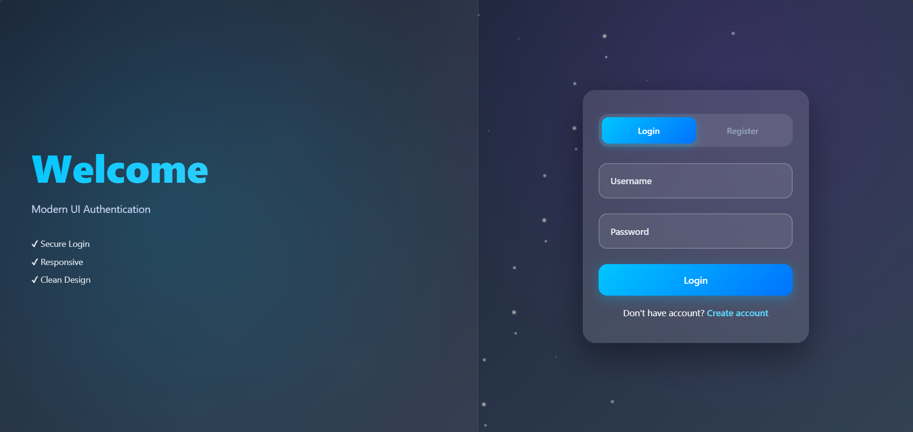

# Modern Authentication UI 🔐

A responsive and visually clean **Login & Registration interface** built using HTML and CSS, with basic JavaScript for interactivity.

---

## Preview

  

---

## Live Demo 🌐

👉 https://amanhari1808-arch.github.io/Modern-Login-Ui/

---

## Overview

This project was created to practice building a structured and user-friendly authentication interface. I initially developed the base layout and functionality using HTML and CSS.

The design was later enhanced using AI tools to improve the visual appearance and introduce more modern UI elements.

---

## Features ✨

* Login and Register forms in a single interface
* Password show/hide functionality
* Responsive layout for different screen sizes
* Modern UI styling with gradients and blur effects

---

## Technologies Used

* HTML
* CSS
* JavaScript (basic usage)

---

## My Contribution

* Built the initial layout and structure
* Applied styling using CSS
* Integrated and adjusted AI-assisted UI improvements
* Reviewed and modified the code to match the final design

---

## Learning Note 📘

This project reflects my current stage in learning front-end development. I am comfortable with HTML and CSS fundamentals and currently improving my JavaScript skills.

Some interactive features were implemented with the help of AI tools, and I am actively working to understand them in depth.

---

## Future Improvements 🚀

* Strengthen JavaScript knowledge
* Add form validation
* Connect to a backend for real authentication
* Improve code structure and accessibility

---

## Disclaimer

This is a front-end project only and does not include real authentication or data storage.

---

## Conclusion

This project demonstrates my ability to build a functional UI and improve it using modern tools while continuing to develop my technical skills.
